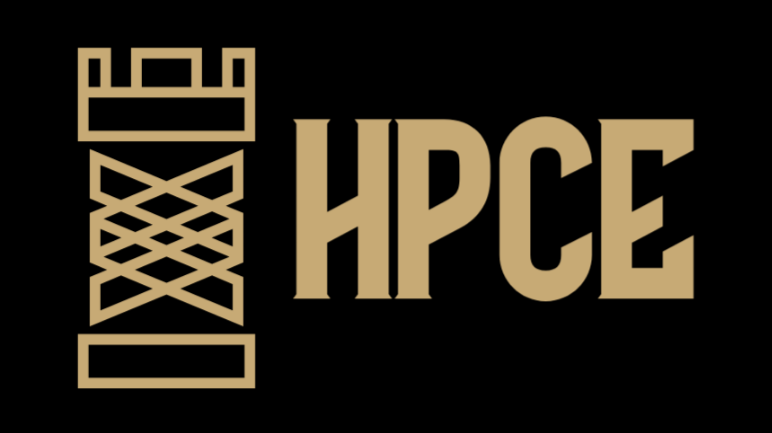

# HPCE: High-Performance Chess Engine

  

<p align="center">
  
</p>

HPCE is a high-performance chess engine written in C++ that supports:

- **Deep Neural Network Input Sequence/Token Generation**: Integrate our engine backend into your deep neural network to parse games into tokens.
- **Transformer DNN implementation**: Discover our machine learning model for move evaluation.
- **PGN File Streaming**: Parse and manage chess games in the Portable Game Notation (PGN) format.
- **Customizable Chess Rulesets**: Extend and modify piece behavior with an adaptable ruleset.
- **Test Driver**: Comprehensive testing capabilities to validate engine functionality.

## Features

### Core Engine
- **Chess_Board Class** (`hpce.cpp` / `hpce.h`):
  - Initializes a chessboard instance.
  - Handles move execution using standard chess notation.
  - Retrieves current game scores.
  - Verifies move legality based on a robust ruleset for each piece.
  - Extensible architecture to modify piece behavior by altering individual rulesets.
  - Compile as static or shared library to use in your own project.

### Transformer DNN
- **Pytorch model** (`hpce_model.py` / `hpce_data_loader.py` / `hpce_model_train.py`):
  - Using Pybind bindings, integrate the HPCE engine into your own model data loader.
  - Train a model using our predefined model.
  - Alter input sequence token generation for your custom needs.

### PGN Support
- **PGN_Chess_Game Class** (`pgn_chess_game.cpp` / `pgn_reader.h`):
  - Stores PGN tag pairs and all game moves.
- **PGN_Reader Class** (`pgn_reader.cpp` / `pgn_reader.h`):
  - Parses PGN files and translates moves into engine-compatible objects.
  - Provides structured access to game metadata and moves.

### Testing
- Includes a **test driver** to validate chess engine operations, ensuring legal move generation, scoring, and PGN parsing integrity. See [TESTING.md](./TESTING.md) for details.

## Getting Started

### Prerequisites

- **C++ Compiler**: Ensure you have a C++17 (or later) compatible compiler installed.
- **Build Tools**: 
  - `cmake`.

### Installation

1. Clone the repository:
   ```bash
   git clone https://github.com/pr0f3ss/hpce.git
   cd hpce
   ```

2. Build the project:
   ```bash
   mkdir build && cd build
   cmake ..
   make
   ```

   For Windows MinGW-based systems use:
      ```bash
   mkdir build && cd build
   cmake -G "MinGW Makefiles" ..
   make
   ```

3. Run the tests:
   ```bash
   ./hpce_tests
   ```

## Usage

### Running the Engine

1. Compile the engine:
   ```bash
   make hpce_engine
   ```

2. Execute the engine with a PGN file:
   ```bash
   ./hpce_engine sample_game.pgn
   ```

### Example PGN File
```pgn
[Event "Casual Game"]
[Site "Chess Club"]
[Date "2024.12.15"]
[White "Alice"]
[Black "Bob"]

1. e4 e5 2. Nf3 Nc6 3. Bb5 a6
```

Place your PGN files in the `data/` directory or provide an absolute path.

### Extending Rulesets
Modify the `Chess_Board` implementation in `HPCE.cpp` to add or adjust rules for specific pieces. For example:
- Add custom moves for new chess variants.
- Create unique scoring logic based on specific conditions.

## Project Structure

```
HPCE/
├── src/
│   ├── hpce.cpp                # Core engine implementation
│   ├── pgn_chess_game.cpp      # PGN object implementation
│   ├── pgn_reader.cpp          # PGN parsing implementation
│   └── hpce_model/
│       ├── hpce_data_loader.py # Model data loader
│       ├── hpce_model_train.py # Model training file
│       └── hpce_model.cpp      # Model definition file
│
├── include/                    # Header files
│
├── tests/
│   ├── notation_generator.py   # Generate notations for test case implementation
│   ├── hpce_test_driver.h      # Test driver header
│   └── hpce_tests.cpp          # Test file runner
│
├── data/                       # Test pgn files
├── training_data/              # Training pgn files
├── CMakeLists.txt              # Build configuration
└── README.md                   # Project documentation
```

## Contributing

Contributions are welcome! Here’s how you can get started:

1. Fork the repository.
2. Create a new branch (`git checkout -b feature/your-feature`).
3. Commit your changes (`git commit -m 'Add your message'`).
4. Push the branch (`git push origin feature/your-feature`).
5. Open a Pull Request.

## License

This project is licensed under the MIT License - see the [LICENSE](LICENSE) file for details.

## Acknowledgments

- Thanks to the chess and programming community for inspiring this project!

---

### Let’s Play Chess with High Performance!

